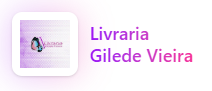

# Livraria Gilede Vieira

Aplicação front-end da Livraria Gilede Vieira, desenvolvida em React, TypeScript, Vite e Tailwind CSS. O projeto organiza as visões de cliente e administração com foco em navegação fluida, responsividade mobile-first e manutenção simples para evolução gradual.

## Tecnologias utilizadas

- React
- TypeScript
- Vite
- Tailwind CSS
- React Router DOM
- Lucide React
- Sonner

## Protótipo no Figma Make

Acesse o executável do Figma Make:

https://www.figma.com/make/rwjacpeoPzZD85ky6eCKND/Projeto-Integrador---Gilede-Vieira?fullscreen=1&t=qaLI2NcNt1YvYtwA-1&code-node-id=0-9

## Interface

## Interface

Logo da aplicação:



Banner principal:


> Observação: os arquivos `logo-livraria.png` e `banner-livraria.png` estão em `src/assets/`. Substitua-os pelas imagens finais de alta resolução quando disponíveis.

## Como executar localmente

1. Instale as dependências:

```bash
npm install
```

2. Rode o servidor de desenvolvimento:

```bash
npm run dev
```

3. Gere a build de produção:

```bash
npm run build
```
